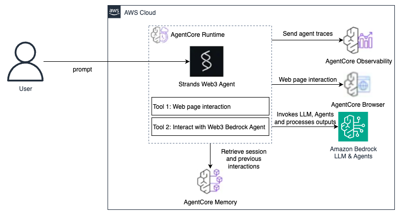
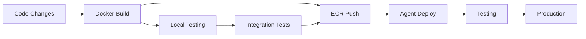

# Web3 Agents Workshop

## Workshop Overview

This workshop demonstrates building and deploying Web3 AI agents using a Docker-based approach with Strands Agents and Amazon Bedrock AgentCore. You'll learn to containerize agents, deploy them to AWS, and integrate with external AWS services and Bedrock agents.

### What You'll Learn

* Amazon Bedrock AgentCore and Strands Agents architecture
* Docker-based build and deployment workflows
* Tool integration in Strands agents for Web3 data gathering (exa, browser automation)
* Agent-to-agent communication patterns with Bedrock Agents
* AWS KMS integration for Ethereum Virtual Machine (EVM) compatible wallets

## Architecture Overview

### Core Components

The architecture consists of three main layers:

1. **Agent Layer**: Strands Agents framework providing the AI agent runtime
2. **Platform Layer**: Amazon Bedrock AgentCore for managed deployment and scaling
3. **Infrastructure Layer**: Docker containers running on AWS with ECR for image management


### AgentCore & Strands Integration




## Development Workflow

### CI/CD Pipeline



### Deployment Pipeline Stages

1. **Source Control**: Git-based version control
2. **Container Build**: Automated Docker image creation
3. **Registry Push**: ECR image storage and versioning
4. **Agent Deployment**: Bedrock AgentCore deployment automation
5. **Health Checks**: Automated testing and monitoring
6. **Rollback**: Automated rollback on failure

## Prerequisites

### Required Tools

- **Docker Desktop** (latest version)
- **AWS CLI** v2.x configured with appropriate permissions
- **Python 3.11+** for local development
- **jq** for JSON processing (install via `brew install jq` on macOS or `apt-get install jq` on Linux)
- **uv** package manager (will be installed in Module 1, Step 1)

### Required AWS Services

Ensure your AWS account has access to:
- Amazon Bedrock (with model access enabled)
- Amazon ECR (Elastic Container Registry)
- Amazon Bedrock AgentCore
- AWS IAM (for role management)
- Amazon CloudWatch (for logging)
- AWS X-Ray (for tracing)

### AWS Permissions Required

Your AWS user/role needs the following permissions:

```json
{
    "Version": "2012-10-17",
    "Statement": [
        {
            "Effect": "Allow",
            "Action": [
                "bedrock:*",
                "bedrock-agentcore:*",
                "ecr:*",
                "iam:CreateRole",
                "iam:AttachRolePolicy",
                "iam:CreatePolicy",
                "iam:GetRole",
                "iam:PassRole",
                "logs:*",
                "xray:*"
            ],
            "Resource": "*"
        }
    ]
}
```

📄 **[View full code: aws_permissions.json](./code/aws_permissions.json)**


## Module 1: Basic Streaming Agent with Exa Search

In this module, you'll build a basic Web3 agent that can search for real-time cryptocurrency and blockchain information using the Exa search tool.

We will be using `uv` for `venv` creation and dependency management. Let's first install `uv`:

```bash
curl -LsSf https://astral.sh/uv/install.sh | sh
```

Ensure that `uv` is in your `$PATH` and create a local development environment:
```bash
uv init
uv venv
uv add boto3
```

**Note**: After installing `uv`, you may need to restart your terminal or run `source ~/.bashrc` (Linux/macOS) to update your PATH.

### Step 1: Configure Dependencies

Create `requirements.txt` to be used for our Web3 agent, with all necessary dependencies:

```txt
# core agent framework
strands-agents>=0.1.0
bedrock-agentcore>=0.1.0
strands-agents-tools>=0.1.0

# web automation
playwright>=1.40.0

# AWS integrations
langchain-aws>=0.1.0
boto3>=1.34.0
botocore>=1.34.0
```

📄 **[View full code: requirements.txt](./code/requirements.txt)**


### Step 2: Create a Long-Term Web3 Analyst Knowledge Base
Create `create_web3_agent_memory.py`:
```python
from bedrock_agentcore.memory import MemoryClient
from bedrock_agentcore.memory.constants import StrategyType
from botocore.exceptions import ClientError
import os
import boto3

memory_client = MemoryClient(region_name=os.environ["AWS_REGION"])
memory_name = "Web3AnalystMemory"

try:
    memory = memory_client.create_memory_and_wait(
        name=memory_name,
        description="Memory for sample agent conversations",
        strategies=[
            {
                StrategyType.SUMMARY.value: {
                    "name": "SessionSummarizer",
                    "namespaces": ["sample-agent/summaries/{actorId}/{sessionId}"]
                }
            },
            {
                StrategyType.USER_PREFERENCE.value: {
                    "name": "UserPreferences",
                    "description": "Captures user preferences and behavior",
                    "namespaces": ["sample-agent/preferences/{actorId}"],
                }
            },
            {
                StrategyType.SEMANTIC.value: {
                    "name": "FactExtractor",
                    "description": "Stores facts from conversations",
                    "namespaces": ["sample-agent/semantic/{actorId}/"],
                }
            },
        ],
        event_expiry_days=7, # Memories expire after 7 days
    )
    memory_id = memory.get('id') # The memory_id will be used in following operations
    print(f"✅ Memory ID: {memory_id}")
except ClientError as e:
    print(f"❌ ERROR: {e}")
    if e.response['Error']['Code'] == 'ValidationException' and "already exists" in str(e):
        # If memory already exists, retrieve its ID
        memories = memory_client.list_memories()
        memory_id = next((m['id'] for m in memories if m['id'].startswith(memory_name)), None)
        print(f"Memory already exists. Using existing memory ID: {memory_id}")
except Exception as e:
    # Show any errors during memory creation
    print(f"❌ ERROR: {e}")
    import traceback
    traceback.print_exc()
    # Cleanup on error - delete the memory if it was partially created
    if memory_id:
        try:
            memory_client.delete_memory_and_wait(memory_id=memory_id)
            print(f"Cleaned up memory: {memory_id}")
        except Exception as cleanup_error:
            print(f"Failed to clean up memory: {cleanup_error}")
```

📄 **[View full code: create_web3_agent_memory.py](./code/create_web3_agent_memory.py)**


Run the `create_web3_agent_memory.py` script to create a new memory database. Remember the `MemoryID` for the `Dockerfile` later.
```bash
uv run create_web3_agent_memory.py

#  Memory ID: Web3AnalystMemory-0OZZp7Doxi
```

### Step 3: Implement the Streaming Agent with Memory Support

#### Implement Memory-Enhanced Agent

Create `memory.py`, so that we can import it into our agents later. The file will be added to the `Dockerfile` automatically.
```python
from strands.hooks import AfterInvocationEvent, HookProvider, HookRegistry, MessageAddedEvent
import re
import logging
from bedrock_agentcore.memory import MemoryClient

logger = logging.getLogger(__name__)
logging.getLogger().setLevel(logging.ERROR) # Set the logging level to ERROR

class LongTermMemoryHooks(HookProvider):
    """Memory hooks for long-term memory agent"""

    def __init__(
        self, memory_id: str, client: MemoryClient, actor_id: str, session_id: str
    ):
        self.memory_id = memory_id
        self.client = client
        self.actor_id = actor_id
        self.session_id = session_id
        self.namespaces = {
            i["type"]: i["namespaces"][0]
            for i in self.client.get_memory_strategies(self.memory_id)
        }

    def retrieve_user_context(self, event: MessageAddedEvent):
        """Retrieve user context before processing support query"""
        logger.info("Start to retrieve user context...")
        messages = event.agent.messages
        if (
            messages[-1]["role"] == "user"
            and "toolResult" not in messages[-1]["content"][0]
        ):
            user_query = messages[-1]["content"][0]["text"]

            try:
                all_context = []

                for context_type, namespace in self.namespaces.items():
                    # *** AGENTCORE MEMORY USAGE *** - Retrieve customer context from each namespace
                    memories = self.client.retrieve_memories(
                        memory_id=self.memory_id,
                        namespace=namespace.format(actorId=self.actor_id, sessionId=""),
                        query=user_query,
                        top_k=3,
                    )
                    # Post-processing: Format memories into context strings
                    for memory in memories:
                        if isinstance(memory, dict):
                            content = memory.get("content", {})
                            if isinstance(content, dict):
                                text = content.get("text", "").strip()
                                if text:
                                    all_context.append(
                                        f"[{context_type.upper()}] {text}"
                                    )

                # Inject user context into the query
                if all_context:
                    context_text = "\n".join(all_context)
                    original_text = messages[-1]["content"][0]["text"]
                    messages[-1]["content"][0][
                        "text"
                    ] = f"User Context: {context_text}\n\n User Query: {original_text}"
                    logger.info(f"Retrieved {len(all_context)} user context items")

            except Exception as e:
                logger.error(f"Failed to retrieve user context: {e}")

    def save_conversation(self, event: AfterInvocationEvent):
        """Save user interaction after agent response"""
        try:
            messages = event.agent.messages
            if len(messages) >= 2 and messages[-1]["role"] == "assistant":
                # Get last user query and agent response
                user_query = None
                agent_response = None

                for msg in reversed(messages):
                    if msg["role"] == "assistant" and not agent_response:
                        output_message = msg["content"][0]["text"]
                        agent_response = re.sub(r'<thinking>.*?</thinking>', '', output_message, flags=re.DOTALL).strip()

                    elif (
                        msg["role"] == "user"
                        and not user_query
                        and "toolResult" not in msg["content"][0]
                    ):
                        input_prompt = msg["content"][0]["text"]
                        user_query = re.sub(r'User Context:.*? User Query: ', '', input_prompt, flags=re.DOTALL).strip()
                        break

                if user_query and agent_response:
                    # *** AGENTCORE MEMORY USAGE *** - Save the support interaction
                    self.client.create_event(
                        memory_id=self.memory_id,
                        actor_id=self.actor_id,
                        session_id=self.session_id,
                        messages=[
                            (user_query, "USER"),
                            (agent_response, "ASSISTANT"),
                        ],
                    )
                    logger.info(f"Saved support interaction to memory")

        except Exception as e:
            logger.error(f"Failed to save support interaction: {e}")

    def register_hooks(self, registry: HookRegistry) -> None:
        """Register user support memory hooks"""
        registry.add_callback(MessageAddedEvent, self.retrieve_user_context)
        registry.add_callback(AfterInvocationEvent, self.save_conversation)
        logger.info("User support memory hooks registered")
```

📄 **[View full code: memory.py](./code/memory.py)**

Create `strands_agents_streaming_memory.py` with long-term memory. Uncomment the `tool use events` if required for `debugging` purpose.
```python
import asyncio
import os
import logging
import uuid
from datetime import datetime
from strands import Agent, tool
from bedrock_agentcore import BedrockAgentCoreApp

from bedrock_agentcore.memory import MemoryClient
from botocore.exceptions import ClientError
from memory import LongTermMemoryHooks

region = os.getenv("AWS_REGION", "us-east-1")
logging.basicConfig(level=logging.INFO)
logger = logging.getLogger(__name__)

user_id = "user_001"
session_id = str(uuid.uuid4())
memory_id = os.environ["MEMORY_ID"]
memory_client = MemoryClient(region_name=region)
memory_hooks = LongTermMemoryHooks(memory_id, memory_client, user_id, session_id)
version = "Agent with Memory v0.0.1"

@tool
def get_version() -> dict:
    """Return the version of the agent."""
    return {"version": version}

app = BedrockAgentCoreApp()

agent = Agent(
    tools=[get_version],
    system_prompt=f"""You are a helpful personal assistant with long-term memory capabilities.
        
        You can help with:
        - General questions about blockchain
        - Remembering user preferences and past conversations
        - Personal task management
        
        AVAILABLE TOOLS:
        - get_version: Returns the current version of this agent
        
        Your memory system automatically stores and retrieves conversation context.
        When users ask about past conversations or their preferences, recall from memory.
        
        Today's date: {datetime.today().strftime('%Y-%m-%d')}
        Be friendly and professional.""",
    hooks=[memory_hooks],
    state={"actor_id": user_id, "session_id": session_id},
    model="us.anthropic.claude-sonnet-4-20250514-v1:0",
)

@app.entrypoint
async def agent_invocation(payload):
    """Handler for agent invocation"""

    stream = agent.stream_async(payload["prompt"])
    async for event in stream:
        if "data" in event:
            yield event["data"]
        if "tool_use" in event:
            tool_info = event["tool_use"]
            tool_name = tool_info.get("name", "Unknown")
            tool_input = tool_info.get("input", {})

            # Format the tool call as a special marker that can be easily detected by the client
            yield f"\n\n<tool_call>\n"
            yield f"name: {tool_name}\n"
            yield f"params: {tool_input}\n"
            yield f"</tool_call>\n\n"

        # Check for current_tool_use in chunk (which appears in delta updates)
        # elif "current_tool_use" in event:
        #     tool_info = event["current_tool_use"]
        #     tool_name = tool_info.get('name', 'Unknown')
        #     tool_input = tool_info.get('input', {})
        #     tool_id = tool_info.get('toolUseId', '')

        #     # Format the tool call as a special marker
        #     yield f"\n\n<tool_call>\n"
        #     yield f"name: {tool_name}\n"
        #     yield f"id: {tool_id}\n"
        #     yield f"params: {tool_input}\n"


if __name__ == "__main__":
    app.run()
```

📄 **[View full code: strands_agents_streaming_memory.py](./code/strands_agents_streaming_memory.py)**


### Step 3: Configure Docker

First, verify your Docker installation:

```bash
# Verify Docker installation
docker --version
```

Create a `Dockerfile` for containerizing the agent, ensure to provide the right `MEMORY_ID` and `AWS_REGION`:

```dockerfile
FROM ghcr.io/astral-sh/uv:python3.11-bookworm-slim
WORKDIR /app

# Configure UV for container environment
ENV UV_SYSTEM_PYTHON=1 UV_COMPILE_BYTECODE=1

# Copy requirements and install dependencies
COPY requirements.txt requirements.txt
RUN uv pip install -r requirements.txt

# Install AWS OpenTelemetry for observability
RUN uv pip install aws-opentelemetry-distro>=0.10.1

# Set AWS region environment variables
ENV AWS_REGION=us-east-1

# Signal that this is running in Docker for host binding logic
ENV DOCKER_CONTAINER=1

# MemoryID
ENV MEMORY_ID="Web3AnalystMemory-0OZZp7Doxi"

# Create non-root user for security
RUN useradd -m -u 1000 bedrock_agentcore
USER bedrock_agentcore

# Expose ports for agent communication
EXPOSE 8080
EXPOSE 8000

# Copy entire project (respecting .dockerignore)
COPY . .

# Default command - can be overridden for different agent types
CMD ["opentelemetry-instrument", "python", "-m", "strands_agents_streaming_memory"]
```

📄 **[View full code: Dockerfile](./code/Dockerfile)**

### Step 4: Deploy to AWS

```bash
export AWS_ACCOUNT_ID=$(aws sts get-caller-identity | jq -r '.Account')
export AWS_REGION=us-east-1
```

#### Create ECR Repository

```bash
# Create ECR repository for your Web3 agent
aws ecr create-repository \
    --repository-name web3-strands-agent \
    --region $AWS_REGION

# Expected output includes repository URI:
# 123456789012.dkr.ecr.us-east-1.amazonaws.com/web3-strands-agent
```

#### Authenticate and Build Docker Image
```bash
# Get ECR login credentials
aws ecr get-login-password --region $AWS_REGION | \
    docker login --username AWS --password-stdin \
    ${AWS_ACCOUNT_ID}.dkr.ecr.${AWS_REGION}.amazonaws.com

# Build and push Docker image (ARM64 for better performance)
docker buildx build \
    --platform linux/arm64 \
    -t ${AWS_ACCOUNT_ID}.dkr.ecr.${AWS_REGION}.amazonaws.com/web3-strands-agent:latest \
    --push .
```

#### Create IAM Role for Agent Runtime

Create `create_agent_runtime_role.py`:
```python
import boto3
import json
import logging

logging.basicConfig(level=logging.INFO)
logger = logging.getLogger(__name__)

def create_agent_runtime_role():
    """Create IAM role for Bedrock AgentCore runtime with Web3 permissions."""
    
    iam = boto3.client('iam')
    role_name = 'Web3AgentCoreExecutionRole'
    
    # Trust policy
    trust_policy = {
        "Version": "2012-10-17",
        "Statement": [
            {
                "Effect": "Allow",
                "Principal": {
                    "Service": "bedrock-agentcore.amazonaws.com"
                },
                "Action": "sts:AssumeRole"
            }
        ]
    }
    
    # Execution policy with Web3 agent permissions
    execution_policy = {
        "Version": "2012-10-17",
        "Statement": [
            {
                "Effect": "Allow",
                "Action": [
                    "bedrock:InvokeModel",
                    "bedrock:InvokeModelWithResponseStream",
                    "bedrock:InvokeAgent"
                ],
                "Resource": "*",
                "Sid": "BedrockAccess"
            },
            {
                "Effect": "Allow",
                "Action": [
                    "bedrock-agentcore:*"
                ],
                "Resource": "*",
                "Sid": "AgentCoreAccess"
            },
            {
                "Effect": "Allow",
                "Action": [
                    "ecr:GetAuthorizationToken",
                    "ecr:BatchCheckLayerAvailability",
                    "ecr:GetDownloadUrlForLayer",
                    "ecr:BatchGetImage"
                ],
                "Resource": "*",
                "Sid": "ECRAccess"
            },
            {
                "Effect": "Allow",
                "Action": [
                    "xray:PutTraceSegments",
                    "xray:PutTelemetryRecords"
                ],
                "Resource": "*",
                "Sid": "XRayTracing"
            },
            {
                "Effect": "Allow",
                "Action": [
                    "logs:CreateLogGroup",
                    "logs:CreateLogStream",
                    "logs:PutLogEvents"
                ],
                "Resource": "*",
                "Sid": "CloudWatchLogging"
            },
            {
                "Effect": "Allow",
                "Action": [
                    "ssm:GetParameter",
                    "ssm:PutParameter",
                    "ssm:DeleteParameter"
                ],
                "Resource": "arn:aws:ssm:*:*:parameter/web3-agent/*",
                "Sid": "SSMParameterAccess"
            },
            {
                "Effect": "Allow",
                "Action": [
                    "bedrock-agentcore:CreateMemory",
                    "bedrock-agentcore:GetMemory",
                    "bedrock-agentcore:ListMemories",
                    "bedrock-agentcore:DeleteMemory",
                    "bedrock-agentcore:CreateEvent",
                    "bedrock-agentcore:GetEvent",
                    "bedrock-agentcore:ListEvents"
                ],
                "Resource": "*",
                "Sid": "AgentCoreMemoryAccess"
            }
        ]
    }
    
    try:
        # Create role
        role_response = iam.create_role(
            RoleName=role_name,
            AssumeRolePolicyDocument=json.dumps(trust_policy),
            Description='Execution role for Web3 Bedrock AgentCore agents'
        )
        
        # Create and attach policy
        policy_response = iam.create_policy(
            PolicyName=f'{role_name}Policy',
            PolicyDocument=json.dumps(execution_policy),
            Description='Execution policy for Web3 Bedrock AgentCore agents'
        )
        
        iam.attach_role_policy(
            RoleName=role_name,
            PolicyArn=policy_response['Policy']['Arn']
        )
        
        logger.info(f"Created role: {role_response['Role']['Arn']}")
        return role_response['Role']['Arn']
        
    except iam.exceptions.EntityAlreadyExistsException:
        role_response = iam.get_role(RoleName=role_name)
        logger.info(f"📁 Role already exists: {role_response['Role']['Arn']}")
        return role_response['Role']['Arn']

if __name__ == "__main__":
    role_arn = create_agent_runtime_role()
    print(f"Role ARN: {role_arn}")
```
📄 **[View full code: create_agent_runtime_role.py](./code/create_agent_runtime_role.py)**

Run the `create_agent_runtime_role.py` script:

```bash
uv run create_agent_runtime_role.py

# INFO:__main__:Created role: arn:aws:iam::123456789012:role/Web3AgentCoreExecutionRole
# Role ARN: arn:aws:iam::123456789012:role/Web3AgentCoreExecutionRole
```


#### Deploy Agent to AgentCore

Create `deploy_agent.py` - `latest` can be replaced with custom tags if required:

```python
import boto3
import os

client = boto3.client('bedrock-agentcore-control',
                      region_name=os.environ["AWS_REGION"])

response = client.create_agent_runtime(
    agentRuntimeName='strands_agent',
    agentRuntimeArtifact={
        'containerConfiguration': {
            'containerUri': f'{os.environ["AWS_ACCOUNT_ID"]}.dkr.ecr.{os.environ["AWS_REGION"]}.amazonaws.com/web3-strands-agent:latest'
        }
    },
    networkConfiguration={"networkMode": "PUBLIC"},
    roleArn=f'arn:aws:iam::{os.environ["AWS_ACCOUNT_ID"]}:role/Web3AgentCoreExecutionRole'
)

print(f"Agent Runtime created successfully!")
print(f"Agent Runtime ARN: {response['agentRuntimeArn']}")
print(f"Status: {response['status']}")
```

📄 **[View full code: deploy_agent.py](./code/deploy_agent.py)**

Run the deployment script:
```bash
uv run deploy_agent.py

# Agent Runtime created successfully!
# Agent Runtime ARN: arn:aws:bedrock-agentcore:us-east-1:123456789012:runtime/strands_agent-ii31SM8zRv
# Status: CREATING
```

**Important**: 
1. Save the Agent Runtime ARN from the output - you'll need it for testing
2. Wait for the status to change from `CREATING` to `ACTIVE` before proceeding (typically 2-5 minutes)
3. Check the status with:
   ```bash
   aws bedrock-agentcore-control get-agent-runtime \
     --agent-runtime-id strands_agent-ii31SM8zRv \
     --region $AWS_REGION
   ```

### Step 5: Test Your Agent

Now that we have deployed our first Web3 agent, let's interact with it using a Python chat interface. 

```bash
export AGENT_RUNTIME_ARN="arn:aws:bedrock-agentcore:us-east-1:123456789012:runtime/strands_agent-ii31SM8zRv"
uv add rich
```

Create `invoke_agent_async.py`, an interactive terminal based chat interface:
```python
#!/usr/bin/env python3
import boto3
import json
import uuid
import os
from datetime import datetime
from rich.console import Console

console = Console()

class AgentChat:
    def __init__(self):
        # Initialize the Bedrock AgentCore client
        self.agent_core_client = boto3.client("bedrock-agentcore",
                                                region_name=os.environ["AWS_REGION"])
        self.agent_runtime_arn = os.environ["AGENT_RUNTIME_ARN"]
        # Generate a unique session ID for this chat session
        self.session_id = (
            str(uuid.uuid4()).replace("-", "")[:40] + "f"
        )
        

        print("Web3 Strands Agent Chat Interface")
        print("=" * 50)
        print(f"Session ID: {self.session_id}")
        print("Type 'quit', 'exit', or 'bye' to end the chat")
        print("=" * 50)

    def extract_text_from_response(self, response_data):
        """Extract text from the expected response format"""
        try:
            if isinstance(response_data, dict):
                # Navigate the expected structure: output.message.content[0].text
                output = response_data.get("output", {})
                message = output.get("message", {})
                content = message.get("content", [])

                if content and isinstance(content, list) and len(content) > 0:
                    first_content = content[0]
                    if isinstance(first_content, dict) and "text" in first_content:
                        return first_content["text"]

            return None
        except (KeyError, IndexError, TypeError):
            return None

    def stream_response(self, response):
        if "text/event-stream" in response.get("contentType", ""):
            complete_text = ""
            for line in response["response"].iter_lines(chunk_size=1):
                if line:
                    line = line.decode("utf-8")
                    if line.startswith("data: "):
                        json_chunk = line[6:]
                        try:
                            parsed_chunk = json.loads(json_chunk)
                            if isinstance(parsed_chunk, str):
                                text_chunk = parsed_chunk
                            else:
                                text_chunk = json.dumps(
                                    parsed_chunk, ensure_ascii=False
                                )
                                text_chunk += "\n\n"
                            console.print(text_chunk, end="")
                            # print(text_chunk, end="")
                            complete_text += text_chunk
                        except json.JSONDecodeError:
                            console.print(json_chunk)
                            # print(json_chunk)
                            continue
            console.print()
            return {}

        elif response.get("contentType") == "application/json":
            # Handle standard JSON response
            content = []
            for chunk in response.get("response", []):
                content.append(chunk.decode("utf-8"))

            try:
                response_data = json.loads("".join(content))
                text = self.extract_text_from_response(response_data)
                if text:
                    print(text, end="", flush=True)
                    response_text = text
            except json.JSONDecodeError:
                pass

        else:
            # For other content types, try to extract from the response object
            text = self.extract_text_from_response(response)
            if text:
                print(text, end="", flush=True)
                response_text = text

        return response_text

    def send_message(self, user_input):
        """Send a message to the agent and stream the response"""
        try:
            # Prepare the payload
            payload = json.dumps(
                {
                    "prompt": user_input
                }
            )

            # Invoke the agent
            response = self.agent_core_client.invoke_agent_runtime(
                agentRuntimeArn=self.agent_runtime_arn,
                runtimeSessionId=self.session_id,
                payload=payload,
                qualifier="DEFAULT",
            )

            # Stream the response
            return self.stream_response(response)

        except Exception as e:
            print(f"\n Error: {e}")
            return None

    def chat_loop(self):
        """Main chat loop"""
        try:
            while True:
                # Get user input
                try:
                    user_input = input("\n You: ").strip()
                except (EOFError, KeyboardInterrupt):
                    print("\n\nGoodbye!")
                    break

                # Check for exit commands
                if user_input.lower() in ["quit", "exit", "bye", "q"]:
                    print("Goodbye!")
                    break

                # Skip empty input
                if not user_input:
                    continue

                # Send message and get response
                print("Agent: ", end="", flush=True)
                response = self.send_message(user_input)

                if response is None:
                    print("Sorry, I couldn't process your request. Please try again.")

        except KeyboardInterrupt:
            print("\n\nChat interrupted. Goodbye!")


def main():
    """Main function to start the chat interface"""
    chat = AgentChat()
    chat.chat_loop()


if __name__ == "__main__":
    main()
```

📄 **[View full code: invoke_agent_async.py](./code/invoke_agent_async.py)**

Run the chat interface:

```bash
uv run invoke_agent_async.py
```

#### Test Scenarios

Try these prompts to test your agent - evaluate `memory` by starting different sessions:

```
💬 You: What is DeFi and how does it work?
💬 You: Tell me about the latest developments in Ethereum
💬 You: What are the risks of yield farming?
💬 You: What do you remember of me?
```

---

## Module 2: Browser-Enabled Agent

Let's integrate browser automation capabilities to gather unstructured data from web sources. This allows the agent to scrape real-time market data, analyst opinions, and sentiment information without relying on dedicated APIs.

### Step 1: Update IAM Permissions for Browser Tool

Update the IAM role to include permissions for AgentCore Browser Tool.
Create `update_agent_runtime_role_browser.py`:

```python
import boto3
import json
import logging

logging.basicConfig(level=logging.INFO)
logger = logging.getLogger(__name__)

def update_agent_runtime_role_for_browser():
    """Update IAM role to include AgentCore Browser Tool permissions."""
    
    iam = boto3.client('iam')
    role_name = 'Web3AgentCoreExecutionRole'
    
    browser_policy = {
        "Version": "2012-10-17",
        "Statement": [
            {
                "Effect": "Allow",
                "Action": [
                    "bedrock-agentcore:CreateBrowserSession",
                    "bedrock-agentcore:GetBrowserSession",
                    "bedrock-agentcore:DeleteBrowserSession",
                    "bedrock-agentcore:ExecuteBrowserAction"
                ],
                "Resource": "*",
                "Sid": "AgentCoreBrowserAccess"
            },
            {
                "Effect": "Allow",
                "Action": [
                    "bedrock:InvokeModel"
                ],
                "Resource": "arn:aws:bedrock:*::foundation-model/amazon.nova-pro-v1:0",
                "Sid": "NovaModelAccess"
            }
        ]
    }
    
    try:
        # Create and attach browser policy
        policy_response = iam.create_policy(
            PolicyName=f'{role_name}BrowserPolicy',
            PolicyDocument=json.dumps(browser_policy),
            Description='Browser tool policy for Web3 Bedrock AgentCore agents'
        )
        
        iam.attach_role_policy(
            RoleName=role_name,
            PolicyArn=policy_response['Policy']['Arn']
        )
        
        logger.info(f"Attached browser policy: {policy_response['Policy']['Arn']}")
        return policy_response['Policy']['Arn']
        
    except iam.exceptions.EntityAlreadyExistsException:
        logger.info(f"📁 Browser policy already exists")
        # Get existing policy ARN
        account_id = boto3.client('sts').get_caller_identity()['Account']
        policy_arn = f"arn:aws:iam::{account_id}:policy/{role_name}BrowserPolicy"
        return policy_arn
    except Exception as e:
        logger.error(f"Error updating role: {e}")
        raise

if __name__ == "__main__":
    policy_arn = update_agent_runtime_role_for_browser()
    print(f"Browser Policy ARN: {policy_arn}")
```

📄 **[View full code: update_agent_runtime_role_browser.py](./code/update_agent_runtime_role_browser.py)**

Run the script to update permissions:

```bash
uv run update_agent_runtime_role_browser.py

# INFO:__main__:Attached browser policy: arn:aws:iam::123456789012:policy/Web3AgentCoreExecutionRoleBrowserPolicy
# Browser Policy ARN: arn:aws:iam::123456789012:policy/Web3AgentCoreExecutionRoleBrowserPolicy
```

### Step 2: Implement Browser-Enabled Agent
Create `strands_agents_streaming_memory_browser.py` with web scraping capabilities:
```python
import asyncio
import os
import logging
import uuid
from datetime import datetime
from strands import Agent, tool
from bedrock_agentcore import BedrockAgentCoreApp
from bedrock_agentcore.memory import MemoryClient
from botocore.exceptions import ClientError
from playwright.sync_api import sync_playwright, Playwright, BrowserType
from bedrock_agentcore.tools.browser_client import browser_session
from langchain_aws import ChatBedrock
from memory import LongTermMemoryHooks

logging.basicConfig(level=logging.INFO)
logger = logging.getLogger(__name__)

region = os.getenv("AWS_REGION", "us-east-1")
user_id = "user_001"
session_id = str(uuid.uuid4())
memory_id = os.environ["MEMORY_ID"]
memory_client = MemoryClient(region_name=region)
memory_hooks = LongTermMemoryHooks(memory_id, memory_client, user_id, session_id)
version = "Agent with Memory and Browser - v0.0.1"


def get_coin_data_with_browser(playwright: Playwright, coin: str) -> str:
    """Get cryptocurrency market data using browser"""
    with browser_session(os.environ.get("AWS_REGION", "us-east-1")) as client:
        ws_url, headers = client.generate_ws_headers()
        chromium: BrowserType = playwright.chromium
        browser = chromium.connect_over_cdp(ws_url, headers=headers)

        try:
            context = browser.contexts[0] if browser.contexts else browser.new_context()
            page = context.pages[0] if context.pages else context.new_page()
            page.goto(f"https://coinmarketcap.com/currencies/{coin}")
            content = page.inner_text("body")

            llm = ChatBedrock(model_id="amazon.nova-pro-v1:0", region_name=os.environ.get("AWS_REGION", "us-east-1"))
            prompt = "Extract cryptocurrency coin price and key information, key news for {} from this page content. Be concise:\n\n{}".format(coin, content[:3000])
            result = llm.invoke(prompt).content
            logger.info(f"llm result for {coin}: {result}")

            return result

        finally:
            if not page.is_closed():
                page.close()
            browser.close()

@tool
def get_version() -> dict:
    """Return the version of the agent."""
    return {"version": version}

@tool
def get_coin_data(coin: str) -> str:
    """Get cryptocurrency data for a given symbol"""
    try:
        with sync_playwright() as p:
            return get_coin_data_with_browser(p, coin)
    except Exception as e:
        logger.error(f"Error getting data for {coin}: {str(e)}")
        return f"Error getting data for {coin}: {str(e)}"
app = BedrockAgentCoreApp()
agent = Agent(
    tools=[get_coin_data, get_version],
    system_prompt=f"""You're an expert market intelligence analyst with deep expertise in financial markets, business strategy, and economic trends. You have advanced long-term memory capabilities to store and recall financial interests for each user you work with.

    PURPOSE:
    - Provide real-time cryptocurrency market analysis
    - Maintain long-term financial profiles for each user
    - Store and recall investment preferences, risk tolerance, and financial goals
    - Build ongoing professional relationships through comprehensive memory
        
    AVAILABLE TOOLS:
    - get_coin_data: Retrieves current cryptocurrency prices, changes, and market data
      * Parameter: coin (string) - Full coin name (e.g., "bitcoin" not "btc", "ethereum" not "eth")
    - get_version: Returns the current version of this agent

    WORKFLOW:
    1. Identify user and recall their cryptocurrency preferences from memory
    2. For market data requests, use get_coin_data with the full coin name
    3. Store user preferences and conversation context in memory for future interactions

    Today's date: {datetime.today().strftime('%Y-%m-%d')}
    Be friendly and professional.""",
    hooks=[memory_hooks],
    state={"actor_id": user_id, "session_id": session_id},
    model="us.anthropic.claude-sonnet-4-20250514-v1:0",
)


@app.entrypoint
async def agent_invocation(payload):
    """Handler for agent invocation"""

    stream = agent.stream_async(payload["prompt"])
    async for event in stream:
        if "data" in event:
            yield event["data"]
        if "tool_use" in event:
            tool_info = event["tool_use"]
            tool_name = tool_info.get("name", "Unknown")
            tool_input = tool_info.get("input", {})

            # Format the tool call as a special marker that can be easily detected by the client
            yield f"\n\n<tool_call>\n"
            yield f"name: {tool_name}\n"
            yield f"params: {tool_input}\n"
            yield f"</tool_call>\n\n"

if __name__ == "__main__":
    app.run()

```


📄 **[View full code: strands_agents_streaming_memory_browser.py](./code/strands_agents_streaming_memory_browser.py)**

### Step 3: Update Agent Deployment

Create `update_agent.py` to trigger the agent runtime to pull the latest Docker image:
```python
import boto3
import os

client = boto3.client('bedrock-agentcore-control',
                       region_name=os.environ["AWS_REGION"])

response = client.update_agent_runtime(
    agentRuntimeId=os.environ["AGENT_RUNTIME_ARN"].split("/")[1],
    agentRuntimeArtifact={
        'containerConfiguration': {
            'containerUri': f'{os.environ["AWS_ACCOUNT_ID"]}.dkr.ecr.{os.environ["AWS_REGION"]}.amazonaws.com/web3-strands-agent:latest'
        }
    },
    networkConfiguration={"networkMode": "PUBLIC"},
    roleArn=f'arn:aws:iam::{os.environ["AWS_ACCOUNT_ID"]}:role/Web3AgentCoreExecutionRole'
)

print(f"Agent Runtime updated successfully!")
print(f"Agent Runtime ARN: {response['agentRuntimeArn']}")
print(f"Status: {response['status']}")

```

📄 **[View full code: update_agent.py](./code/update_agent.py)**

### Step 4: Build, Deploy, and Test

**Important**: Update the `Dockerfile` CMD line to point to the browser-enabled agent:

```dockerfile
# In your Dockerfile, change the last line to:
CMD ["opentelemetry-instrument", "python", "-m", "strands_agents_streaming_memory_browser"]
```

Then trigger the build, update, and test steps in a single command:

```bash
docker buildx build --platform linux/arm64 \
  -t ${AWS_ACCOUNT_ID}.dkr.ecr.${AWS_REGION}.amazonaws.com/web3-strands-agent:latest \
  --push . && \
uv run update_agent.py

# Agent Runtime updated successfully!
# Agent Runtime ARN: arn:aws:bedrock-agentcore:us-east-1:123456789012:runtime/strands_agent-ii31SM8zRv
# Status: UPDATING
```

```bash
uv run invoke_agent_async.py
```


#### Test Scenarios

Test the browser automation capabilities:

```
💬 You: Get me the current price of bitcoin
💬 You: What's happening with ethereum today?
💬 You: Compare bitcoin and solana performance
```

---

## Module 3: Agent-to-Agent Integration

### Understanding Multi-Agent Patterns

Let's reflect on what we've learned:
- Single agents can have multiple tools
- Tools require routing logic (typically via system prompts)
- Complex implementations can become difficult to maintain

**Solution**: Use the [Agentic AI Orchestration Pattern](https://docs.aws.amazon.com/prescriptive-guidance/latest/agentic-ai-serverless/pattern-agentic-ai-orchestration.html) to distribute responsibilities across specialized agents.

### Architecture: Strands Agent Calling Bedrock Agent


**Reference Implementation**: [Crypto AI Agents on Amazon Bedrock](https://github.com/aws-samples/crypto-ai-agents-with-amazon-bedrock)

The deployment process of `crypto-ai-agents-with-amazon-bedrock` will print parameters such as `agentId` or `agentAliasId`. 
We will need these to point our agent at `CryptoAI_Supervisor_Agent` later on.

### Step 1: Update IAM Permissions for Agent-to-Agent Communication

Update the IAM role to include permissions for invoking other Bedrock Agents.

Create `update_agent_runtime_role_agent_invoke.py`:

```python
import boto3
import json
import logging

logging.basicConfig(level=logging.INFO)
logger = logging.getLogger(__name__)

def update_agent_runtime_role_for_agent_invoke():
    """Update IAM role to include Bedrock Agent invocation permissions."""
    
    iam = boto3.client('iam')
    role_name = 'Web3AgentCoreExecutionRole'
    
    # Additional policy for Agent-to-Agent communication
    agent_invoke_policy = {
        "Version": "2012-10-17",
        "Statement": [
            {
                "Effect": "Allow",
                "Action": [
                    "bedrock:InvokeAgent",
                    "bedrock:GetAgent",
                    "bedrock:ListAgents"
                ],
                "Resource": "*",
                "Sid": "BedrockAgentInvocation"
            },
            {
                "Effect": "Allow",
                "Action": [
                    "kms:Decrypt",
                    "kms:DescribeKey",
                    "kms:GetPublicKey"
                ],
                "Resource": "*",
                "Sid": "KMSAccess"
            }
        ]
    }
    
    try:
        # Create and attach agent invoke policy
        policy_response = iam.create_policy(
            PolicyName=f'{role_name}AgentInvokePolicy',
            PolicyDocument=json.dumps(agent_invoke_policy),
            Description='Agent invocation policy for Web3 Bedrock AgentCore agents'
        )
        
        iam.attach_role_policy(
            RoleName=role_name,
            PolicyArn=policy_response['Policy']['Arn']
        )
        
        logger.info(f"Attached agent invoke policy: {policy_response['Policy']['Arn']}")
        return policy_response['Policy']['Arn']
        
    except iam.exceptions.EntityAlreadyExistsException:
        logger.info(f"📁 Agent invoke policy already exists")
        # Get existing policy ARN
        account_id = boto3.client('sts').get_caller_identity()['Account']
        policy_arn = f"arn:aws:iam::{account_id}:policy/{role_name}AgentInvokePolicy"
        return policy_arn
    except Exception as e:
        logger.error(f"Error updating role: {e}")
        raise

if __name__ == "__main__":
    policy_arn = update_agent_runtime_role_for_agent_invoke()
    print(f"Agent Invoke Policy ARN: {policy_arn}")
```

📄 **[View full code: update_agent_runtime_role_agent_invoke.py](./code/update_agent_runtime_role_agent_invoke.py)**

Run the script to update permissions:

```bash
uv run update_agent_runtime_role_agent_invoke.py

# INFO:__main__:Attached agent invoke policy: arn:aws:iam::123456789012:policy/Web3AgentCoreExecutionRoleAgentInvokePolicy
# Agent Invoke Policy ARN: arn:aws:iam::123456789012:policy/Web3AgentCoreExecutionRoleAgentInvokePolicy
```

**Note**: If you're integrating with the [Crypto AI Agents](https://github.com/aws-samples/crypto-ai-agents-with-amazon-bedrock) solution, ensure you've deployed that solution first and have the Agent ID and Alias ID ready.

### Step 2: Implement Agent-to-Agent Communication

Create `strands_agents_streaming_memory_a2a.py` for inter-agent communication. Update `agentId="<agentId>"` and `agentAliasId="<agentAliasId>"` first:

```python
import asyncio
import os
import logging
import boto3
import uuid
from datetime import datetime
from strands import Agent, tool
from bedrock_agentcore import BedrockAgentCoreApp

from bedrock_agentcore.memory import MemoryClient
from botocore.exceptions import ClientError
from memory import LongTermMemoryHooks

logging.basicConfig(level=logging.INFO)
logger = logging.getLogger(__name__)

region = os.getenv("AWS_REGION", "us-east-1")
user_id = "user_001"
session_id = str(uuid.uuid4())
memory_id = os.environ["MEMORY_ID"]
memory_client = MemoryClient(region_name=region)
memory_hooks = LongTermMemoryHooks(memory_id, memory_client, user_id, session_id)
version = "Agent with Memory and Trasaction Management Agent - v0.0.1"
bedrock_agent_runtime_client = boto3.client("bedrock-agent-runtime",
                                            region_name=region)

@tool
def invoke_bedrock_agent(prompt: str) -> dict:
    """Invoke a Bedrock Agent Runtime Agent with the given payload."""
    try:
        response = bedrock_agent_runtime_client.invoke_agent(
            agentId="<agentId>",
            agentAliasId="<agentAliasId>",
            sessionId=session_id,
            inputText=prompt,
        )   

        completion = ""

        for event in response.get("completion"):
            chunk = event["chunk"]
            completion += chunk["bytes"].decode()

    except Exception as e:
        logger.error(f"invoking bedrock agent causes error: {e}")
        return {"error": str(e)}

    return completion

@tool
def get_version() -> dict:
    """Return the version of the agent."""
    return {"version": version}


app = BedrockAgentCoreApp()
agent = Agent(
    tools=[invoke_bedrock_agent, get_version],
    system_prompt=f"""You are a coordinator agent that routes requests to specialized blockchain agents.
        
        AVAILABLE TOOLS:
        - invoke_bedrock_agent: Delegates requests to a specialized Bedrock agent for blockchain operations
          * Parameter: prompt (string) - The user's request to forward to the blockchain agent
        - get_version: Returns the current version of this coordinator agent
        
        ROUTING LOGIC:
        Use invoke_bedrock_agent for:
        - Wallet operations (send, check balance, get address)
        - Current cryptocurrency prices
        - Investment advice
        - Transaction cost estimates
        - Historical blockchain data queries
        
        Use get_version for:
        - Version information requests
        
        EXAMPLE REQUESTS FOR invoke_bedrock_agent:
        - "Send 0.1 ETH to vitalik.eth"
        - "What's my current balance?"
        - "What's the price of Bitcoin right now?"
        - "Should I invest in crypto now?"
        - "What's my wallet address?"
        - "How much gas will this cost?"
        
        Today's date: {datetime.today().strftime('%Y-%m-%d')}
        Be friendly and professional.""",
    # hooks=[memory_hooks],
    state={"actor_id": user_id, "session_id": session_id, "version": version},
    model="us.anthropic.claude-sonnet-4-20250514-v1:0",
)


@app.entrypoint
async def agent_invocation(payload):
    """Handler for agent invocation"""
    stream = agent.stream_async(payload["prompt"])
    async for event in stream:
        if "data" in event:
            yield event["data"]

        if "tool_use" in event:
            tool_info = event["tool_use"]
            tool_name = tool_info.get("name", "Unknown")
            tool_input = tool_info.get("input", {})

            # Format the tool call as a special marker that can be easily detected by the client
            yield f"\n\n<tool_call>\n"
            yield f"name: {tool_name}\n"
            yield f"params: {tool_input}\n"
            yield f"</tool_call>\n\n"

if __name__ == "__main__":
    app.run()

```

📄 **[View full code: strands_agents_streaming_memory_a2a.py](./code/strands_agents_streaming_memory_a2a.py)**

### Step 3: Build, Deploy, and Test

**Important**: Update the `Dockerfile` CMD line to point to the agent-to-agent communication agent:

```dockerfile
# In your Dockerfile, change the last line to:
CMD ["opentelemetry-instrument", "python", "-m", "strands_agents_streaming_memory_a2a"]
```

Then follow the same build and deployment process:

```bash
docker buildx build --platform linux/arm64 \
  -t ${AWS_ACCOUNT_ID}.dkr.ecr.${AWS_REGION}.amazonaws.com/web3-strands-agent:latest \
  --push . && \
uv run update_agent.py
```

#### Test Scenarios

Test the agent-to-agent communication:

```
💬 You: Get my KMS wallet address
💬 You: Check the ETH balance for my wallet
💬 You: What's the latest block on Ethereum mainnet?
```

---

## Summary

Congratulations! You've completed the Web3 Agents Workshop. You've learned how to:

1. **Build and deploy** a basic streaming agent with Exa search
2. **Add persistent memory** to maintain conversation context
3. **Integrate browser automation** for web scraping capabilities
4. **Implement agent-to-agent communication** for distributed architectures

### Next Steps

- Explore additional Strands Agents tools and integrations
- Implement custom tools for your specific use cases
- Scale your agent deployment with AWS infrastructure
- Add monitoring and observability with CloudWatch and X-Ray

## Troubleshooting

### Common Issues and Solutions

#### 1. **Docker Build Failures**
```bash
# Error: "failed to solve: process did not complete successfully"
# Solution: Clean Docker cache and rebuild
docker system prune -f
docker buildx build --no-cache --platform linux/arm64 -t your-image:latest .
```

#### 2. **AgentCore Deployment Issues**
```bash
# Error: "ValidationException: Role is not authorized"
# Solution: Verify IAM role trust policy
aws iam get-role --role-name Web3AgentCoreExecutionRole
```

#### 3. **Model Access Issues**
```bash
# Error: "ValidationException: The model is not available"
# Solution: Enable model access in Bedrock console
# 1. Go to AWS Bedrock Console → Model access
# 2. Request access to Anthropic Claude and Amazon Nova models
# 3. Wait for approval (typically instant for Claude)
```

#### 4. **Memory Creation Failures**
```bash
# Error: "AccessDeniedException: User is not authorized to perform: bedrock-agentcore:CreateMemory"
# Solution: Verify IAM permissions include bedrock-agentcore:* actions
```

#### 5. **Browser Tool Timeout**
```bash
# Error: "TimeoutError: Timeout 30000ms exceeded"
# Solution: Check network connectivity and increase timeout if needed
# The browser tool requires stable internet connection
```

### Debugging Tips

1. **Enable Debug Logging**:
   ```python
   import logging
   logging.basicConfig(level=logging.DEBUG)
   ```

2. **Check Agent Runtime Status**:
   ```bash
   aws bedrock-agentcore-control get-agent-runtime \
     --agent-runtime-id YOUR_RUNTIME_ID \
     --region $AWS_REGION
   ```

3. **View CloudWatch Logs**:
   ```bash
   aws logs describe-log-groups --log-group-name-prefix "/aws/bedrock-agentcore"
   ```

## Cleanup

### Complete Cleanup Script

```bash
#!/bin/bash
# cleanup.sh - Remove all workshop resources

echo "🧹 Starting cleanup..."

# Set variables
export AWS_ACCOUNT_ID=$(aws sts get-caller-identity | jq -r '.Account')
export AWS_REGION=${AWS_REGION:-us-east-1}

# Delete Agent Runtime
if [ ! -z "$AGENT_RUNTIME_ARN" ]; then
    RUNTIME_ID=$(echo $AGENT_RUNTIME_ARN | cut -d'/' -f2)
    aws bedrock-agentcore-control delete-agent-runtime \
      --agent-runtime-id $RUNTIME_ID \
      --region $AWS_REGION
    echo "✅ Deleted agent runtime: $RUNTIME_ID"
else
    echo "⚠️  AGENT_RUNTIME_ARN not set, skipping agent runtime deletion"
fi

# Delete ECR Repository
aws ecr delete-repository \
  --repository-name web3-strands-agent \
  --force \
  --region $AWS_REGION 2>/dev/null
echo "✅ Deleted ECR repository"

# Delete IAM Role and Policies
echo "🔍 Cleaning up IAM resources..."
aws iam detach-role-policy \
  --role-name Web3AgentCoreExecutionRole \
  --policy-arn arn:aws:iam::$AWS_ACCOUNT_ID:policy/Web3AgentCoreExecutionRolePolicy 2>/dev/null
aws iam detach-role-policy \
  --role-name Web3AgentCoreExecutionRole \
  --policy-arn arn:aws:iam::$AWS_ACCOUNT_ID:policy/Web3AgentCoreExecutionRoleBrowserPolicy 2>/dev/null
aws iam detach-role-policy \
  --role-name Web3AgentCoreExecutionRole \
  --policy-arn arn:aws:iam::$AWS_ACCOUNT_ID:policy/Web3AgentCoreExecutionRoleAgentInvokePolicy 2>/dev/null

aws iam delete-role --role-name Web3AgentCoreExecutionRole 2>/dev/null
aws iam delete-policy --policy-arn arn:aws:iam::$AWS_ACCOUNT_ID:policy/Web3AgentCoreExecutionRolePolicy 2>/dev/null
aws iam delete-policy --policy-arn arn:aws:iam::$AWS_ACCOUNT_ID:policy/Web3AgentCoreExecutionRoleBrowserPolicy 2>/dev/null
aws iam delete-policy --policy-arn arn:aws:iam::$AWS_ACCOUNT_ID:policy/Web3AgentCoreExecutionRoleAgentInvokePolicy 2>/dev/null

echo "✅ Cleaned up IAM resources"

echo "🎉 Cleanup completed!"
echo "💡 Check CloudWatch log groups and clean them up manually if needed."
```

📄 **[View full code: cleanup.sh](./code/cleanup.sh)**

**Run cleanup**:
```bash
chmod +x workshop/code/cleanup.sh
./workshop/code/cleanup.sh
```

### Resources

- [Strands Agents Documentation](https://strandsagents.com)
- [Amazon Bedrock AgentCore Documentation](https://docs.aws.amazon.com/bedrock/latest/userguide/agents.html)
- [Crypto AI Agents Sample](https://github.com/aws-samples/crypto-ai-agents-with-amazon-bedrock)
- [Agentic AI Patterns](https://docs.aws.amazon.com/prescriptive-guidance/latest/agentic-ai-serverless/)